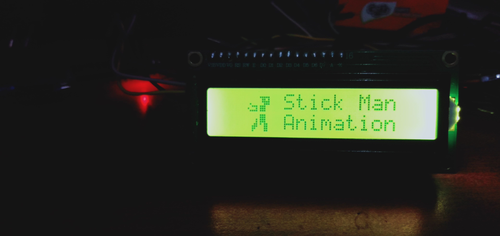

[](https://github.com/ellerbrock/open-source-badges/)
[](https://opensource.org/licenses/MIT)


# Arduino-Nano-based-Designing-Stick-Man-Animation-on-LCD-Screen
LCD berfungsi sebagai penampil karakter. Umumnya karakter yang ditampilkan itu berupa tulisan, namun sebenarnya LCD juga dapat menampilkan gambar, bahkan LCD juga bisa menampilkan suatu animasi dari hasil perulangan. Tujuan diadakannya proyek ini adalah untuk mengedukasi masyarakat tentang bagaimana cara membuat kustomisasi karakter yang mudah di LCD I2C. Proyek ini telah dilaksanakan dan memakan waktu kurang lebih 1 hari. Hasil dari proyek ini berupa animasi Stick Man.

<br><br>

## Kebutuhan Proyek
| Bagian | Deskripsi |
| --- | --- |
| Papan Pengembangan | Arduino Nano V3 |
| Editor Kode | Arduino IDE |
| Driver | CH340 USB Driver |
| Protokol Komunikasi | Inter Integrated Circuit (I2C) |
| Bahasa Pemrograman | C/C++ |
| Pustaka Arduino | LiquidCrystal_I2C |
| Layar | LCD I2C (x1) |
| Komponen Lainnya | • Kabel USB Mini - USB tipe A (x1)<br>• Kabel jumper (1 set) |

<br><br>

## Unduh & Instal
1. Arduino IDE

   <table><tr><td width="810">

   ```
   https://bit.ly/ArduinoIDE_Installer
   ```

   </td></tr></table><br>

2. CH340 USB Driver

   <table><tr><td width="810">

   ```
   https://bit.ly/CH340_USB_Driver
   ```

   </td></tr></table>
   
<br><br>

## Rancangan Proyek
<table>
<tr>
<th width="280">Diagram Blok</th>
<th width="280">Diagram Ilustrasi</th>
<th width="280">Pengkabelan</th>
</tr>
<tr>
<td></td>
<td></td>
<td></td>
</tr>
</table>

<br><br>

## Pengetahuan Dasar

<br><br>

<strong>Gambar di atas menjelaskan bahwa LCD I2C 16x2 memiliki :</strong> 

<table><tr><td width="840">

• Kolom -> ``` 16 ```

• Baris -> ``` 2 ```

• Byte yang ada dalam matriks led -> ``` 8 ```

• Bit yang ada dalam matriks led -> masing-masing barisnya ada ``` 5 ```

</td></tr></table>

<br><br>

## Memindai Alamat I2C Yang Ada Pada LCD
```ino
#include <Wire.h>

void setup() {
  Wire.begin();
  Serial.begin(115200);
  while (!Serial); // Wait for serial monitor
  Serial.println("\nI2C Scanner");
}

void loop() {
  int nDevices = 0;
  Serial.println("Scanning...");

  for (byte address = 1; address < 127; ++address) {
    // The i2c_scanner uses the return value of the Wire.endTransmission to see if a device did acknowledge to the address.
    Wire.beginTransmission(address);
    byte error = Wire.endTransmission();

    if (error == 0) {
      Serial.print("I2C device found at address 0x");
      if (address < 16) {
        Serial.print("0");
      }
      Serial.print(address, HEX);
      Serial.println("  !");

      ++nDevices;
    } else if (error == 4) {
      Serial.print("Unknown error at address 0x");
      if (address < 16) {
        Serial.print("0");
      }
      Serial.println(address, HEX);
    }
  }
  if (nDevices == 0) {
    Serial.println("No I2C devices found\n");
  } else {
    Serial.println("done\n");
  }
  delay(5000); // Wait 5 seconds for next scan
}
```

<br><br>

## Pengaturan Arduino IDE
1. Buka ``` Arduino IDE ``` terlebih dahulu, kemudian buka proyek ini dengan cara klik ``` File ``` -> ``` Open ``` : 

   <table><tr><td width="810">
      
      ``` stickman_animation_lcd.ino ```

   </td></tr></table><br>
   
2. ``` Pengaturan Board ``` di Arduino IDE

   <table>
      <tr><th width="810">

      Cara mengatur board ``` Arduino Nano ```
            
      </th></tr>
      <tr><td>
         
      Klik ``` Tools ``` -> ``` Board ``` -> ``` Arduino AVR Boards ``` -> ``` Arduino Nano ```

      </td></tr>
   </table><br>

3. ``` Ubah Processor ``` di Arduino IDE

   <table><tr><td width="810">
      
      Klik ``` Tools ``` -> ``` Processor ``` -> ``` ATmega328P (Old Bootloader) ```

   </td></tr></table><br>

4. ``` Instal Pustaka ``` di Arduino IDE

   <table><tr><td width="810">
      
      Unduh semua file zip pustaka. Kemudian tempelkan di: ``` C:\Users\Computer_Username\Documents\Arduino\libraries ```

   </td></tr></table><br>

5. ``` Pengaturan Port ``` di Arduino IDE

   <table><tr><td width="810">
      
      Klik ``` Port ``` -> Pilih sesuai dengan port perangkat anda ``` (anda dapat melihatnya di Device Manager) ```

   </td></tr></table><br>

6. Sebelum mengunggah program, silakan klik: ``` Verify ```.<br><br>

7. Jika tidak ada kesalahan dalam kode program, silakan klik: ``` Upload ```.<br><br>

8. Jika masih ada masalah saat unggah program, maka coba periksa pada bagian ``` driver ``` / ``` port ``` / ``` yang lainnya ```.

<br><br>

## Karakter Khusus LCD
Untuk membuat Karakter Khusus LCD dengan mudah, anda dapat mengakses tautan di bawah ini.

<table><tr><td width="840">
      
```
https://maxpromer.github.io/LCD-Character-Creator/
```

</td></tr></table>

<br><br>

## Memulai
1. Unduh dan ekstrak repositori ini.<br><br>

2. Pastikan anda memiliki komponen elektronik yang diperlukan.<br><br>
   
3. Pastikan komponen anda telah dirancang sesuai dengan diagram.<br><br>
   
4. Konfigurasikan perangkat anda menurut pengaturan di atas.<br><br>

5. Selamat menikmati [Selesai].

<br><br>

## Sorotan
<table>
<tr>
<th width="420">Tampilan animasi-1</th>
<th width="420">Tampilan animasi-2</th>
</tr>
<tr>
<td></td>
<td></td>
</tr>
</table>

<br><br>

## Apresiasi
Jika karya ini bermanfaat bagi anda, maka dukunglah karya ini sebagai bentuk apresiasi kepada penulis dengan mengklik tombol ``` ⭐Bintang ``` di bagian atas repositori.

<br><br>

## Penafian
Aplikasi ini merupakan hasil karya saya sendiri dan bukan merupakan hasil plagiat dari penelitian atau karya orang lain, kecuali yang berkaitan dengan layanan pihak ketiga yang meliputi: pustaka, kerangka kerja, dan lain sebagainya.

<br><br>

## LISENSI
LISENSI MIT - Hak Cipta © 2024 - Devan C. M. Wijaya, S.Kom

Dengan ini diberikan izin tanpa biaya kepada siapa pun yang mendapatkan salinan perangkat lunak ini dan file dokumentasi terkait perangkat lunak untuk menggunakannya tanpa batasan, termasuk namun tidak terbatas pada hak untuk menggunakan, menyalin, memodifikasi, menggabungkan, mempublikasikan, mendistribusikan, mensublisensikan, dan/atau menjual salinan Perangkat Lunak ini, dan mengizinkan orang yang menerima Perangkat Lunak ini untuk dilengkapi dengan persyaratan berikut:

Pemberitahuan hak cipta di atas dan pemberitahuan izin ini harus menyertai semua salinan atau bagian penting dari Perangkat Lunak.

DALAM HAL APAPUN, PENULIS ATAU PEMEGANG HAK CIPTA DI SINI TETAP MEMILIKI HAK KEPEMILIKAN PENUH. PERANGKAT LUNAK INI DISEDIAKAN SEBAGAIMANA ADANYA, TANPA JAMINAN APAPUN, BAIK TERSURAT MAUPUN TERSIRAT, OLEH KARENA ITU JIKA TERJADI KERUSAKAN, KEHILANGAN, ATAU LAINNYA YANG TIMBUL DARI PENGGUNAAN ATAU URUSAN LAIN DALAM PERANGKAT LUNAK INI, PENULIS ATAU PEMEGANG HAK CIPTA TIDAK BERTANGGUNG JAWAB, KARENA PENGGUNAAN PERANGKAT LUNAK INI TIDAK DIPAKSAKAN SAMA SEKALI, SEHINGGA RISIKO ADALAH MILIK ANDA SENDIRI.
