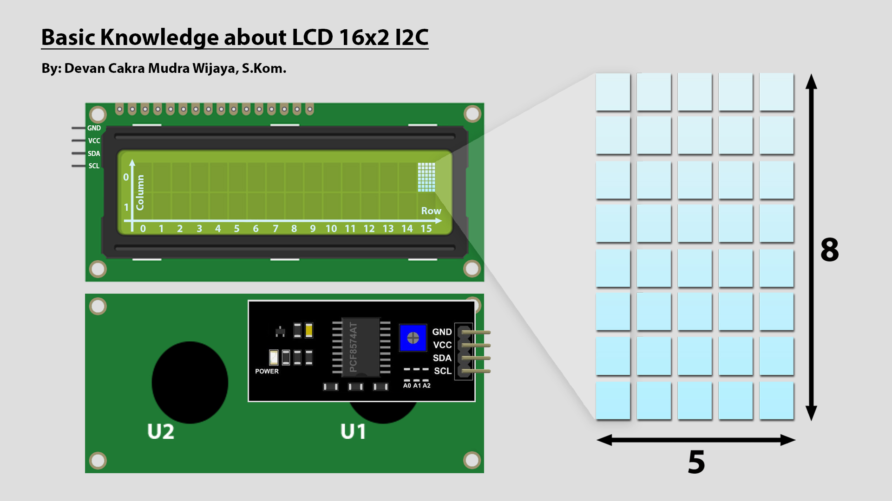
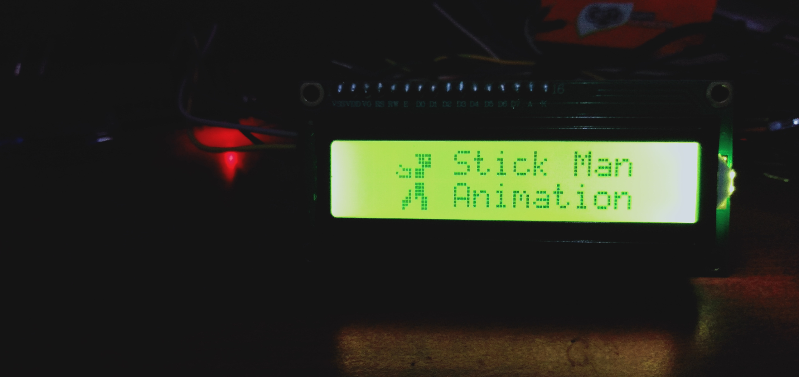
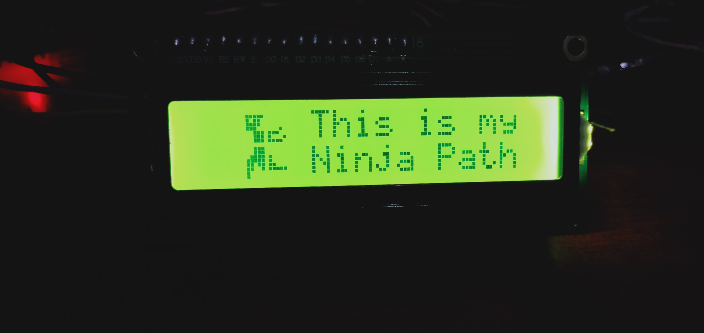

[](https://github.com/ellerbrock/open-source-badges/)
[](https://opensource.org/licenses/MIT)


# Arduino Nano-based Designing Stick Man Animation on LCD Screen
LCD functions as a character viewer. Generally, the characters displayed are in the form of writing, but actually LCD can also display images, even LCD can also display an animation from the results of looping. The purpose of this project is to educate the public on how to make easy character customization on I2C LCD. This project has been implemented and takes approximately 1 day. The result of this project is Stick Man animation.

<br><br>

## Project Requirements
| Part | Description |
| --- | --- |
| Development Board | Arduino Nano V3 |
| Code Editor | Arduino IDE 1.8.19 (Stable Legacy Version) |
| Driver | CH340 USB Driver |
| Communications Protocol | Inter Integrated Circuit (I2C) |
| Programming Language | C/C++ |
| Arduino Library | LiquidCrystal_I2C by Frank de Brabander (Version: 1.1.2) |
| Display | LCD I2C (x1) |
| Other Components | • Mini USB cable - USB type A (x1)<br>• Jumper cable (1 set) |

<br><br>

## Download & Install
1. Arduino IDE

   <table><tr><td width="810">

   ```
   https://bit.ly/ArduinoIDE_Installer
   ```

   </td></tr></table><br>

2. CH340 USB Driver

   <table><tr><td width="810">

   ```
   https://bit.ly/CH340_USBdriver
   ```

   </td></tr></table>
   
<br><br>

## Project Designs
<table>
<tr>
<th width="420">Block Diagram</th>
<th width="420">Pictorial Diagram</th>
</tr>
<tr>
<td></td>
<td></td>
</tr>
</table>
<table>
<tr>
<th width="840">Wiring</th>
</tr>
<tr>
<td></td>
</tr>
</table>

<br><br>

## Basic Knowledge

<br><br>

<strong>The picture above explains that the 16x2 I2C LCD has :</strong>

<table><tr><td width="840">

• Columns -> ``` 16 ```

• Rows -> ``` 2 ```

• Bytes in each led matrix -> ``` 8 ```

• Bits in each led matrix -> in each row there are ``` 5 ```

</td></tr></table>

<br><br>

## Scanning the I2C Address on the LCD
<table><tr><td width="840">

```ino
/*
  =====================================================
  I2C Scanner for Arduino / ESP32 / ESP8266
  by: Devan Cakra Mudra Wijaya, S.Kom.
  =====================================================

  Functions:
  - Detects all connected I2C devices
  - Displays device addresses in HEX format
  - Displays the total number of detected devices


  =====================================================
  SDA and SCL Pins for Arduino / ESP32 / ESP8266
  =====================================================
  Arduino I2C Connection (default):
  - Arduino Uno / Nano (ATmega328P)
    SDA -> A4
    SCL -> A5

  - Arduino Mega 2560
    SDA -> D20
    SCL -> D21

  - Other Arduino boards
    SDA -> SDA pin
    SCL -> SCL pin
    (Refer to the datasheet or board pinout)

  ESP32 I2C Connection (default):
  SDA -> GPIO 21
  SCL -> GPIO 22

  ESP8266 I2C Connection (default):
  SDA -> GPIO 4 (D2)
  SCL -> GPIO 5 (D1)
*/

// Include the Wire library for I2C communication
#include <Wire.h>

// Constant that defines the delay between scans (5000 ms = 5 seconds)
const uint32_t SCAN_INTERVAL = 5000;


// Function to initialize I2C communication
// SDA and SCL pin configuration will be adjusted automatically based on the board being used
void initI2C() {

  // If the board being used is ESP32:
  #if defined(ESP32)

    // Enable I2C communication
    // SDA = GPIO21
    // SCL = GPIO22
    Wire.begin(21, 22);

  // If the board being used is ESP8266:
  #elif defined(ESP8266)

    // Enable I2C communication
    // SDA = D2 (GPIO4)
    // SCL = D1 (GPIO5)
    Wire.begin(D2, D1);

  // If the board is neither ESP32 nor ESP8266
  // Examples: Arduino Uno, Nano, Mega, Leonardo, etc.
  #else

    // Enable I2C communication using the board's built-in hardware pins
    Wire.begin();

  #endif

}


// The setup() function runs once when the board is powered on or reset
// It is used to initialize hardware, serial communication, sensors, modules, and the program's initial configuration
void setup() {

  // Start Serial communication at 115200 baud rate
  Serial.begin(115200);

  // Check whether the board uses native USB
  // Examples: Arduino Leonardo, Arduino Micro, some ESP32-S2/S3 boards
  #if defined(USBCON) || defined(ARDUINO_USB_CDC_ON_BOOT)

    // If yes:
    // The program will wait until the Serial Monitor is connected before continuing execution
    while (!Serial);

  #endif

  // Wait for 2 seconds before starting the program
  delay(2000);

  // Display program header
  Serial.println("====================================");
  Serial.println("         I2C DEVICE SCANNER         ");
  Serial.println("by: Devan Cakra Mudra Wijaya, S.Kom.");
  Serial.println("====================================");

  // Print an empty line
  Serial.println();

  // Initialize I2C communication
  initI2C();
}


// The loop() function runs continuously after setup() has finished
// The main program logic is typically placed inside this function
void loop() {

  // Variable to store the error code returned from I2C communication
  uint8_t error;

  // Variable to store the I2C address currently being checked
  uint8_t address;

  // Counter variable for the number of detected devices
  uint8_t deviceCount = 0;

  // Display information indicating that the scan process has started
  Serial.println("------------------------------------");
  Serial.println("Scanning I2C bus...");
  Serial.println("------------------------------------");

  // Loop through addresses from 1 to 126
  // Valid I2C addresses range from 0x01 to 0x7E
  for (address = 1; address < 127; address++) {

    // Start communication with the address currently being tested
    Wire.beginTransmission(address);

    // End the transmission and store the result
    // 0 = success
    // 1 = data too long
    // 2 = NACK received when address was sent
    // 3 = NACK received when data was sent
    // 4 = other error
    error = Wire.endTransmission();

    // If no error occurs:
    if (error == 0) {

      // Display information that a device was found
      Serial.print("[FOUND] Device at address 0x");

      // If the address is less than 16:
      // Add a leading zero to keep HEX formatting aligned
      if (address < 16) {
        Serial.print("0");
      }

      // Display the address in HEX format
      Serial.println(address, HEX);

      // Increment the detected device count
      deviceCount++;
    }

    // If an unknown error occurs:
    else if (error == 4) {

      // Display an error message
      Serial.print("[ERROR] Unknown error at address 0x");

      // If the address is less than 16:
      // Add a leading zero to keep HEX formatting aligned
      if (address < 16) {
        Serial.print("0");
      }

      // Display the problematic address in HEX format
      Serial.println(address, HEX);
    }

    // If the error is neither 0 nor 4:
    // Ignore it, as this usually means no device exists at that address
  }

  // Print an empty line
  Serial.println();

  // If no devices were found:
  if (deviceCount == 0) {

    // Display a message indicating that no devices were found
    Serial.println("No I2C devices found.");
  }
  else { // If at least one device was found:

    // Display the total number of detected devices
    Serial.print("Total devices found: ");

    // Display the value of deviceCount
    Serial.println(deviceCount);
  }

  // Display information about the next scan
  Serial.print("Next scan in ");

  // Convert milliseconds to seconds
  Serial.print(SCAN_INTERVAL / 1000);

  // Display the unit in seconds
  Serial.println(" seconds.");

  // Empty line
  Serial.println("\n");

  // Wait 5 seconds before performing the next scan
  delay(SCAN_INTERVAL);
}
```

</td></tr></table><br><br>

## Arduino IDE Setup
1. Open the ``` Arduino IDE ``` first, then open this project by clicking ``` File ``` -> ``` Open ``` : 

   <table><tr><td width="810">
      
      ``` stickman_animation_lcd.ino ```

   </td></tr></table><br>
   
2. ``` Board Setup ``` in Arduino IDE

   <table>
      <tr><th width="810">

      How to setup the ``` Arduino Nano ``` board
            
      </th></tr>
      <tr><td width="810">
      
      Select a board by clicking: ``` Tools ``` -> ``` Board ``` -> ``` Arduino AVR Boards ``` -> ``` Arduino Nano ```

      </td></tr>
   </table><br>

3. ``` Change Processor ``` in Arduino IDE

   <table><tr><td width="810">
      
      Click ``` Tools ``` -> ``` Processor ``` -> ``` ATmega328P (Old Bootloader) ```

   </td></tr></table><br>

4. ``` Install Library ``` in Arduino IDE

   <table><tr><td width="810">
      
      Download all the library zip files. Then paste it in the: ``` C:\Users\Computer_Username\Documents\Arduino\libraries ```

   </td></tr></table><br>

5. ``` Port Setup ``` in Arduino IDE

   <table><tr><td width="810">
      
      Click ``` Port ``` -> Choose according to your device port ``` (you can see in device manager) ```

   </td></tr></table><br>

6. Before uploading the program, please click: ``` Verify ```.<br><br>

7. If there is no error in the program code, then please click: ``` Upload ```.<br><br>

8. If there is still a problem when uploading the program, then try checking the ``` driver ``` / ``` port ``` / ``` others ``` section.

<br><br>

## LCD Custom Character
To easily create a LCD Custom Character, you can access the link below.

   <table><tr><td width="840">
      
   ```
   https://maxpromer.github.io/LCD-Character-Creator/
   ```

   </td></tr></table>

<br><br>

## Get Started
1. Download and extract this repository.<br><br>
   
2. Make sure you have the necessary electronic components.<br><br>
   
3. Make sure your components are designed according to the diagram.<br><br>
   
4. Configure your device according to the settings above.<br><br>

5. Please enjoy [Done].

<br><br>

## Highlights
<table>
<tr>
<th width="420">Animation display-1</th>
<th width="420">Animation display-2</th>
</tr>
<tr>
<td></td>
<td></td>
</tr>
</table>

<br><br>

## Appreciation
If this work is useful to you, then support this work as a form of appreciation to the author by clicking the ``` ⭐Star ``` button at the top of the repository.

<br><br>

## Disclaimer
This application is my own work and is not the result of plagiarism from other people's research or work, except those related to third party services which include: libraries, frameworks, and so on.

<br><br>

## LICENSE
MIT License - Copyright © 2024 - Devan C. M. Wijaya, S.Kom

Permission is hereby granted without charge to any person obtaining a copy of this software and the software-related documentation files to deal in them without restriction, including without limitation the right to use, copy, modify, merge, publish, distribute, sublicense, and/or sell copies of the Software, and to permit persons receiving the Software to be furnished therewith on the following terms:

The above copyright notice and this permission notice must accompany all copies or substantial portions of the Software.

IN ANY EVENT, THE AUTHOR OR COPYRIGHT HOLDER HEREIN RETAINS FULL OWNERSHIP RIGHTS. THE SOFTWARE IS PROVIDED AS IS, WITHOUT WARRANTY OF ANY KIND, EITHER EXPRESS OR IMPLIED, THEREFORE IF ANY DAMAGE, LOSS, OR OTHERWISE ARISES FROM THE USE OR OTHER DEALINGS IN THE SOFTWARE, THE AUTHOR OR COPYRIGHT HOLDER SHALL NOT BE LIABLE, AS THE USE OF THE SOFTWARE IS NOT COMPELLED AT ALL, SO THE RISK IS YOUR OWN.
